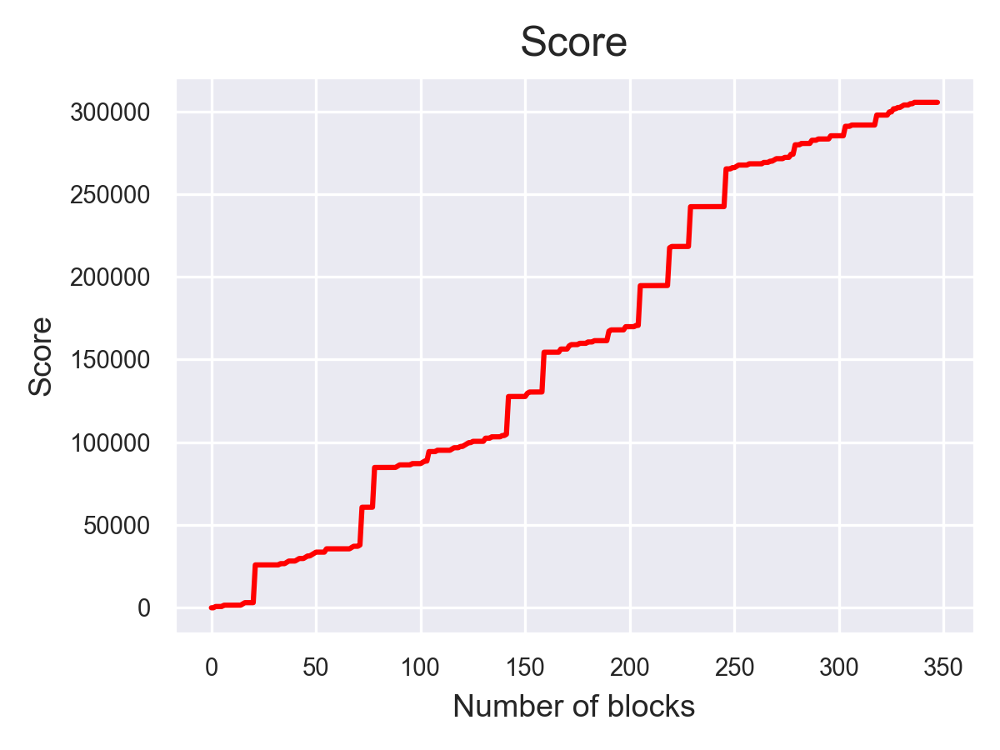
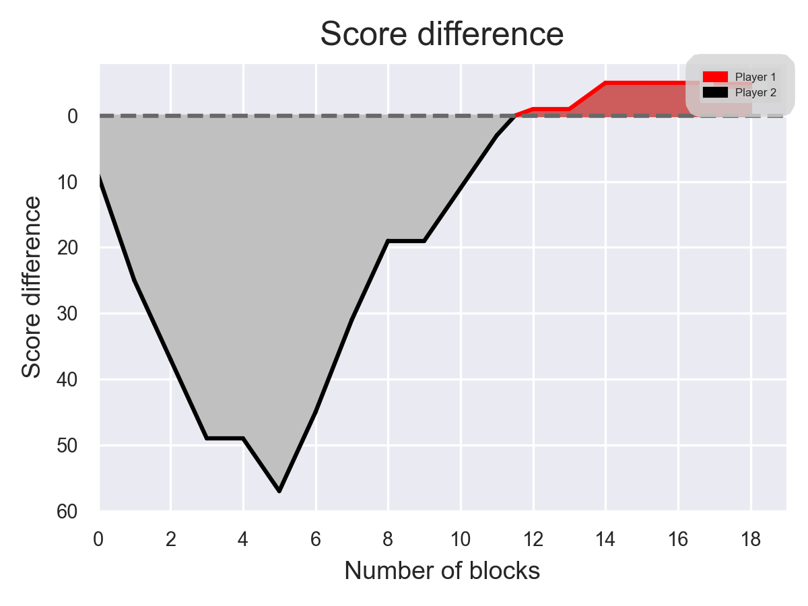
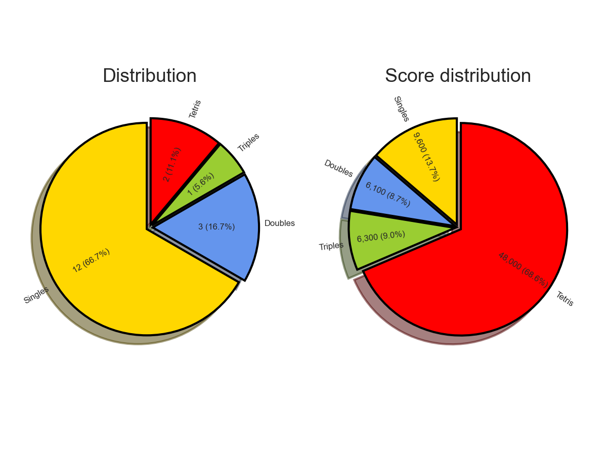
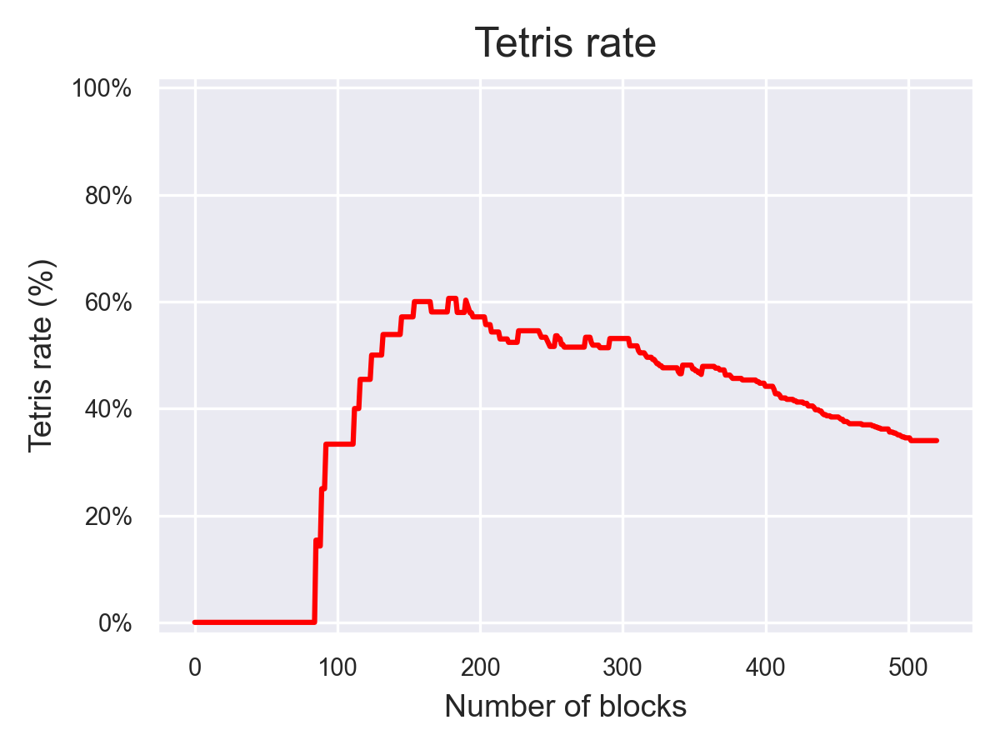
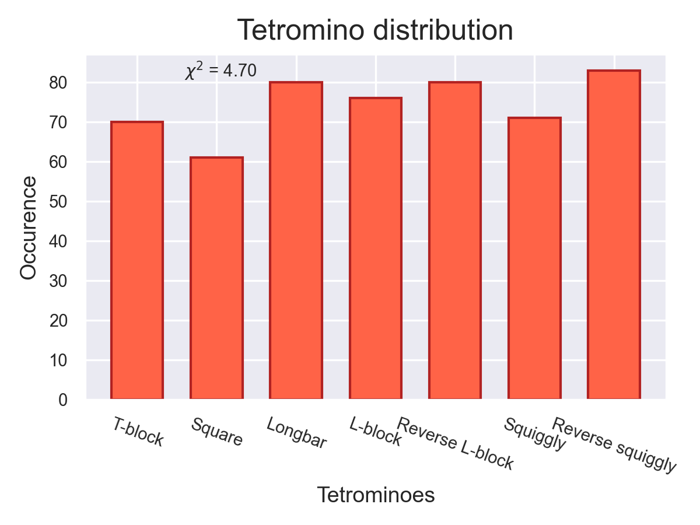
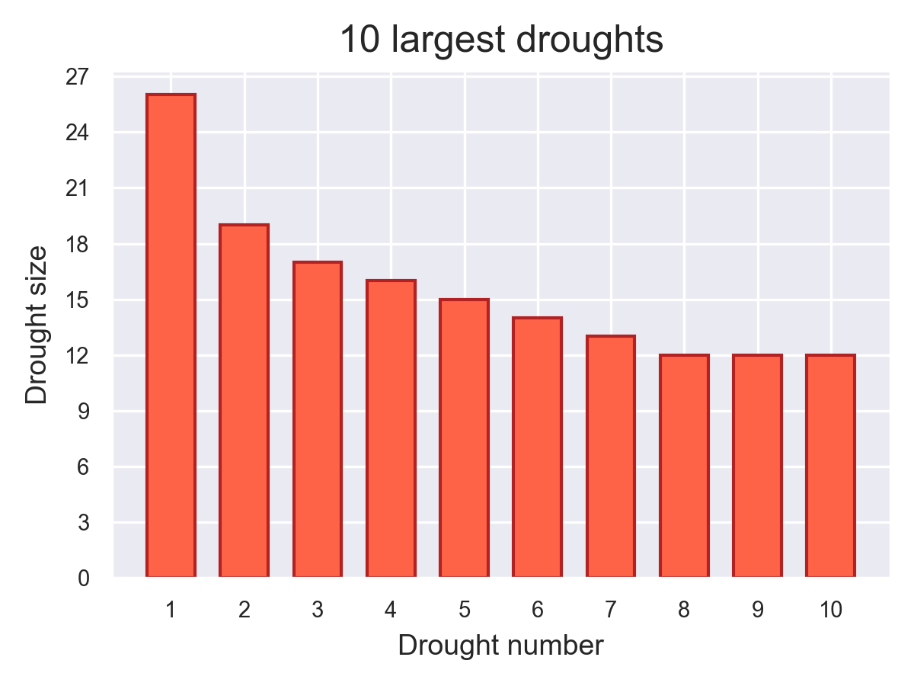

# Boom! Tetris!

Hey! Thanks for taking a look at my game! I enjoy playing NES Tetris but unfortunately there is no local multiplayer and I only have the PAL version. So I thought to myself, why not program these features into my own classic tetris version, and add a whole bunch of extra stuff too? I gave my adaptation the very catchy name 'Boom! Tetris!', below you can read about in more detail.

## Installation

1. Click on the green button that says 'Code'  in the upper part of the screen.
2. Click on 'Download ZIP'.
3. Extract the .zip file after downloading.
4. Double click on the .exe file. It might take a couple of seconds to start the game.

## Introduction

Commentary mode is what makes this Tetris adaptation so fun to play. It is basically the classic 'Boom! Tetris for Jeff!' video (https://www.youtube.com/watch?v=RlnlDKznIaw) turned into a game. Everyone time you tetris you will hear the voices of the Classic Tetris World Championship commentators shout 'Boom! Tetris for Jeff!'. It also possible to select other Tetris icons, such as Jonas or Buco. In local multiplayer mode, the phrase 'It's neck a neck' will be shouted when the two players are within 1 Tetris from each other. Besides that, the game has a lot more to offer. There are other commentary modes, there is a wide variety of music (you can add your own tracks too), you can choose between NTSC or PAL, and there are several post-game statiscal graphs, which allow you to analyze your previously played game. 

Everything is written in the language Python and I have made use of Pygame, which is a set of python modules which you can read about on pygame.org. In the beginning I followed this tutorial on youtube, https://www.youtube.com/watch?v=M3b1n1dXYYs, which shows you the vary basics of how to program Tetris, and after it I programmed everything myself.

If you find bugs, or have a good idea for something to add to the game, or if you want to tell me you enjoy the game, please send an email to afbruinsma@gmail.com.

## Modes & Features

### Singleplayer

Singleplayer mode. You can select levels 0-9 just by clicking and levels 10-19 by holding shift and clicking. Just like NES Tetris there is a score counter, level counter, line counter, piece frequency displayer and a block preview while playing. Besides that, I have added a field in the game which displays the tetris percentage rate, burning rate (number of lines burned since last tetris) and a drought meter that becomes visible after 13 blocks that are not a longbar. These metrics come from the CTWC.

### Multiplayer

This mode provides local two player mode. Player one uses buttons on the left side of the keyboard and player two on the right side. If this feels uncomfortable you could connect controllers with your computer via bluetooth and download keybinding software, such as http://ds4windows.com/. The score difference is shown in the top of the screen, and this can be changed into a Tetris lead if you press 't'. 

### Options menu

In the options menu you can change various settings of the game:

- **Tetromino preview**: A feature that is not included in the original tetris. It allows you to see a preview of your tetromino of how it will look if you just let it fall on your stack. This is a feature in other tetris games, such as Tetris 99. Default value is off. You can toggle this on/off with "h" for player 1 and "k" for player 2.
- **Gridlines**: Displays gridlines for each cell in your matrix. This might allow you to see better in which column you are currently dropping your tetromino. Default value is off. You can toggle this on/off with  “g” for player 1 and “j” for player 2.
- **Hard drop**: Enable/disable hard drop. Default value is on.
- **Tetris version**: Change your tetris version to NTSC or PAL. Default value is NTSC.'
- **Same piecesets**: Determines if you will get the same sets of pieces in multiplayer mode. Default value is on.
- **Music volume**: Adjust the music volume. This is done using the scroll wheel while hovering above the volume indicator.
- **Commentary volume**: Adjust the commentary volume.
- **Singleplayer Controls**: Here you can change the controls for playing singleplayer mode.
- **Multiplayer Controls**: Change the controls when playing 2-player mode.

### Controls

The controls for the movement of the tetromino can be viewed and adjusted in the option menu. The table below shows the function of other keys when in-game.

| Key  | Function  |
|---|---|
| y  | Pause the game  |
| t  | In 2-player mode, toggle between score difference and tetris lead  |
| h  | Toggle tetromino preview player 1 on/off |
| k  | Toggle tetromino preview player 2 on/off |
| g  | Toggle gridlines player 1 on/off  |
| j  | Toggle gridlines player 2 on/off  |

### Music

Select your music here. You can select from the folder '8-bit Bangers' that contains pop/rock songs in 8 bit, from the folder 'Original soundtrack', that contains the original soundtrack of the game, and from the folder 'Other VG tunes', that contains other video game tunes. If you select a song from one of the folders, it will randomly go through all the other songs after the current song has stopped playing.

You can also add more music to the game yourself, just copy/paste soundtracks in one of the above mentioned folders, or add your own folder within the music directory.

### Commentary

I have added a commentary mode into the game in which you can choose from several different kinds of commentaries:

- **Boom! Tetris jor Jeff!**: Each time you *tetris*, the commentators from CTWC (Chris Tang & James Chen) say 'Boom! Tetris for Jeff!', or any other player that is available, such as Quaid and Harry. In multiplayer mode the phrase 'It's very neck a neck' is shouted when the scores of the two multiplayers are within one tetris from each other.
- **The Tetris God**: There is a probability the commentator will shout the name of the piece when it drops from above. See this funny sketch from Collegehumor: https://www.youtube.com/watch?v=Alw5hs0chj0.
- **World Cup 2010**: You will be playing Tetris with tens of thousands of people in the crowd playing a Vuvuzuela, and when you Tetris you will hear the phrase "GOOOAAAAALLLLL". You will probably get tired of this after one game.

### Post-game statistical graphs

When the game is finished (in both the singleplayer and multiplayer mode) a small window appears that says 'Stats'. If you click on this you will see statistics from the previously played game, for example, your score, tetris rate or your largest drought. Click on the small arrow to make the graphs appear.

	
 Score 

	
 

 

	
 Score lead 

	
 

 

	
 Score distribution 

	
 

 

	
 Tetris Rate 

	
 

 

	
 Tetromino Distribution 

	
	
 See https://en.wikipedia.org/wiki/Pearson%27s_chi-squared_test#Discrete_uniform_distribution for more information on the chi squared value.
 

 

	
 Droughts 

	
 
